# LiX <!-- omit in toc -->

[Lix](lix.sty) is a meta-package which bundles other LaTeX packages and commands. To use these bundles, simply specify them when importing the LiX package, either in your own document-class, or directly in your main document when using a predefined class. The goal of this package is to speed up writing your documents, but also to simplify the process of defining your own class.

Disclaimer: This project breaks conventions and practices, which are considered to be "standard" by the LaTeX community. If you want to learn "pure" LaTeX, this is not the project for you. However, for those of you that want to get stuff done as painlessly as possible: enjoy.

Shortcuts: [Examples](#examples) | [Syntax](#syntax) | [Installation](#installation) | [Plans](#plans)

**Motivation**: \
While LaTeX is the indisputable king for typesetting publishable documents, it does have a steep learning curve and is very syntax-heavy. To ease the burden of typesetting and bring the author's focus back on their content, the syntax should be as light as possible. Defining your own look-and-feel is even more inaccessible, if one is not familiar with basic programming -  hence this humble project, which attempts to address these issues.

**Example**: \
Say, we want to setup a book with the US letter size and a specific margin, that has cover art with a title, a subtitle, multiple authors, etc, which should be added to the pdf-metadata. We would also like a page containing formal information, such as licensing and an ISBN-code and maybe a barcode. We want to be able to include centered, scaled figures and syntax-highlighted code blocks, both captioned. We would also like the document to be in Danish, because why not.

All that can be achieved by this:
```latex
\documentclass{book}
\usepackage[all]{lix}

\lang     {danish}
\size     {letter}
\cover    {path/to/front.pdf}{path/to/back.pdf}
\margins  {22mm}{20mm}{21mm}{40mm}
\title    {A Cool Title}
\subtitle {And a Cool Subtitle}
\authors  {Nicklas Vraa}{Another Guy}{Yet Another}
\date     {01/01/2023}
\isbn     {123456789}
\license  {CC}{nc}{3.0}{My Company}
\edition  {3}{2023}

\begin{document}
% ... No need for \maketitle

\h{Introduction}
% ...

    \code{my_snippet}{python}{
    import numpy as np
    % ...
    }{This code does this and that...}

% ...

    \fig{ny_figure}{0.8}{path/to/image.png}{This figures explains how...}

% ...

\end{document}
```
Imagine the LaTeX code, you would have to write to achieve the same - even when using appropriate packages. The layout of each element should be customized by defining a custom class that builds on top of one of the standard classes. Examples are shown later.

**Advantages**:
- The source code of a document becomes as easy to read and understand as Markdown and is drastically shorter.
- The style of a document is completely separated from its content, and keeping a consistent style is simpler.
- Configuring your document is simpler, because you don't interface directly with individual packages, which may employ different syntax.
- Creating your own class, which implements a custom look-and-feel, is much easier.

**Disadvantages**:
- If one wants to change their document into a class that has not been defined using this package, there may be difficulties when compiling. To address this, I've recreated the `IEEEtran` class, as a reference for how to reimplement an existing look using LiX.
- You do not have the extreme fine-grained control over your custom class, as you would with pure LaTeX.
- The command names are not as descriptive as standard LaTeX. Minimal impact on source-code readability was prioritized.


---
## 1. Class Examples <a name="examples"></a>
Using this package, I've defined some custom classes, which are ready for use, as well as classes which mimic popular formats. Look at the source code for each class to see how easily they were defined. It's very simple to convert to another class, as they all share the exact same syntax.
|  |   |   |   |   |   |   |
| ----- | - | - | - | - | - | - |
| [Paper](tests/custom_classes/paper.cls) packs as much information as possible, while adhering to the standards of academic research papers. ([tex](tests/custom_classes/paper_example.tex)) | 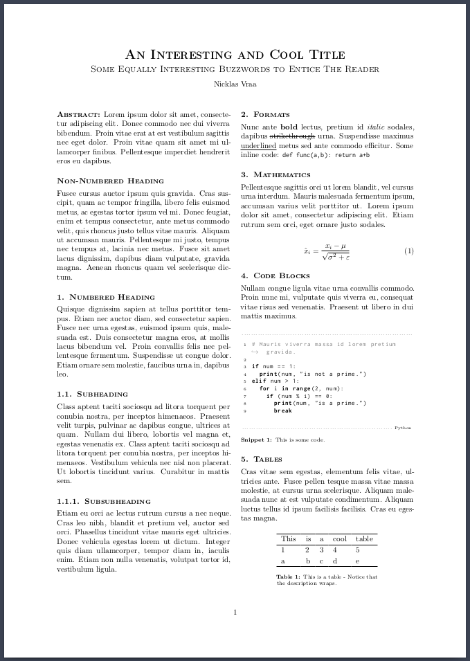 | 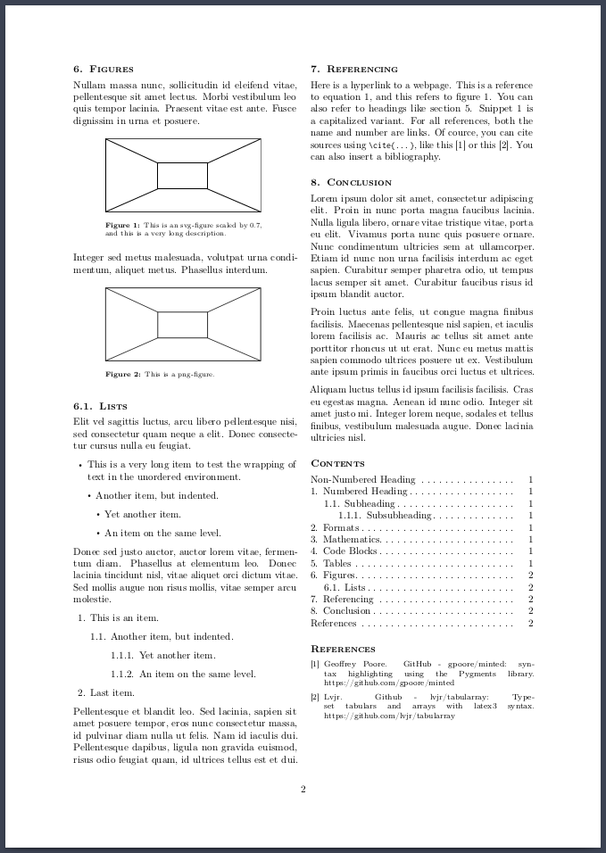 |
| [Novel](tests/custom_classes/novel.cls) is meant for fiction with the intent to print. This class supplies cover-, title- and metadata pages, etc. ([tex](tests/custom_classes/novel_example.tex))|  | 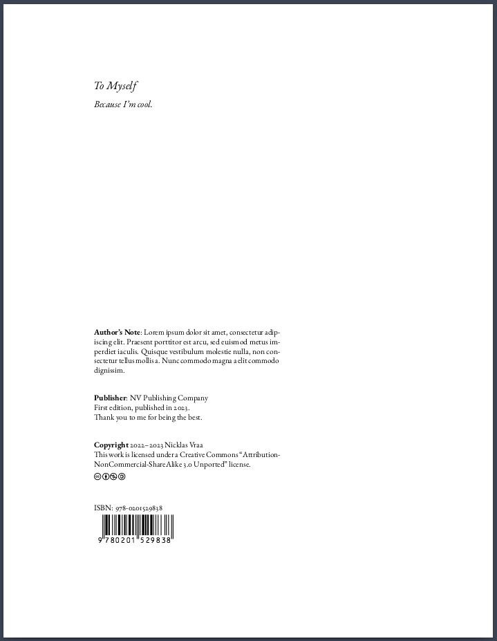 | 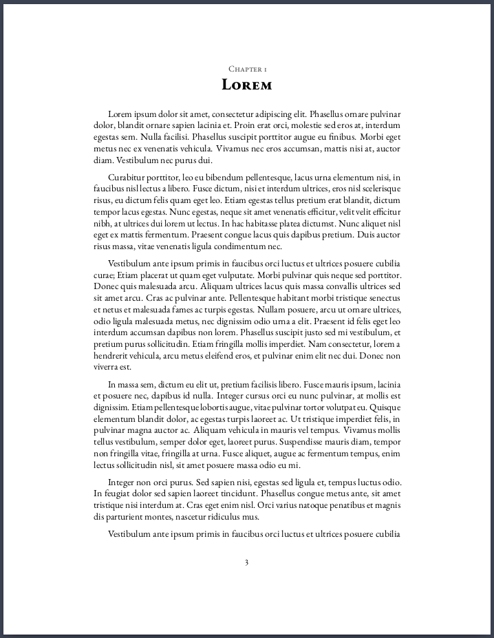 |  |  |  |
| [Textbook](tests/custom_classes/textbook.cls) is intended for typesetting a large amount of academic content to be printed in book form. ([tex](tests/custom_classes/textbook_example.tex))| 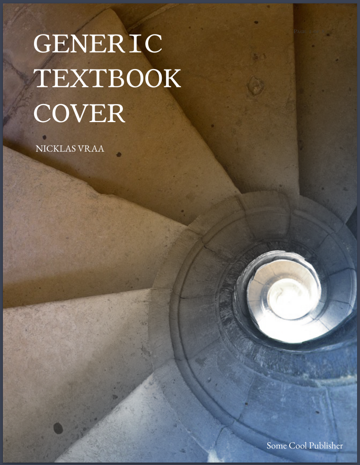 |  | 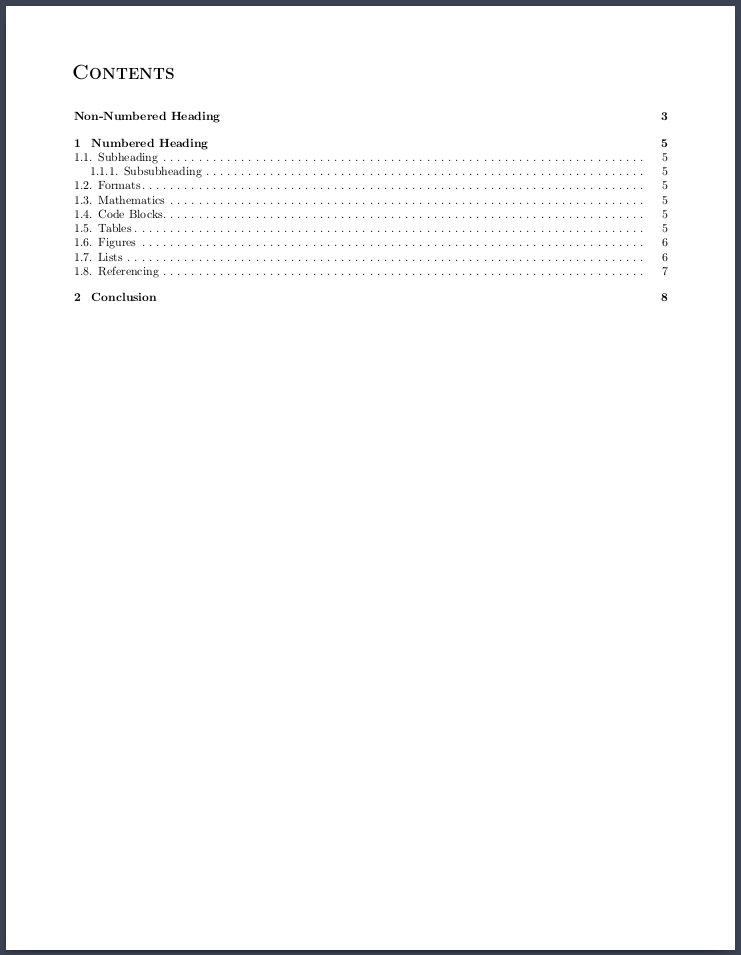 | 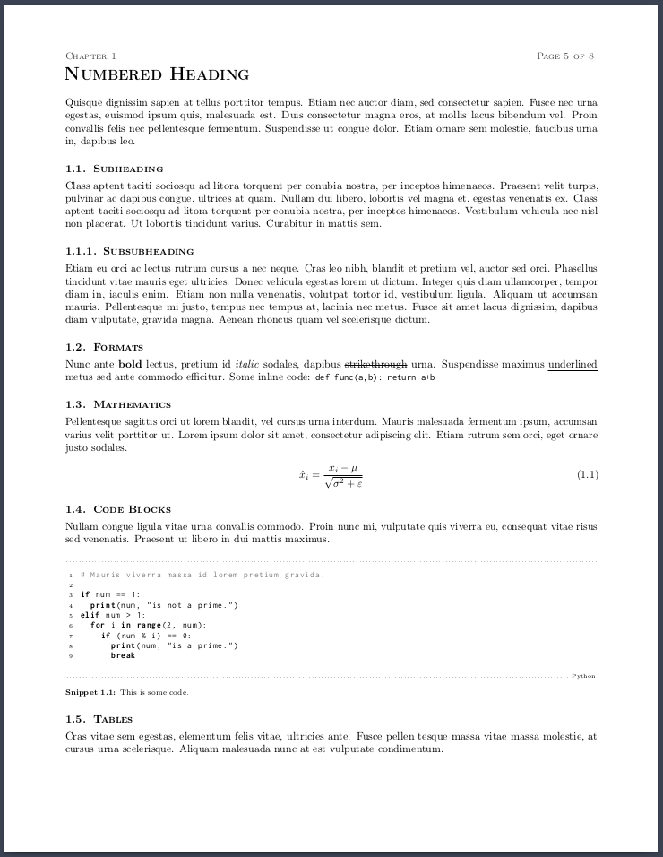 | 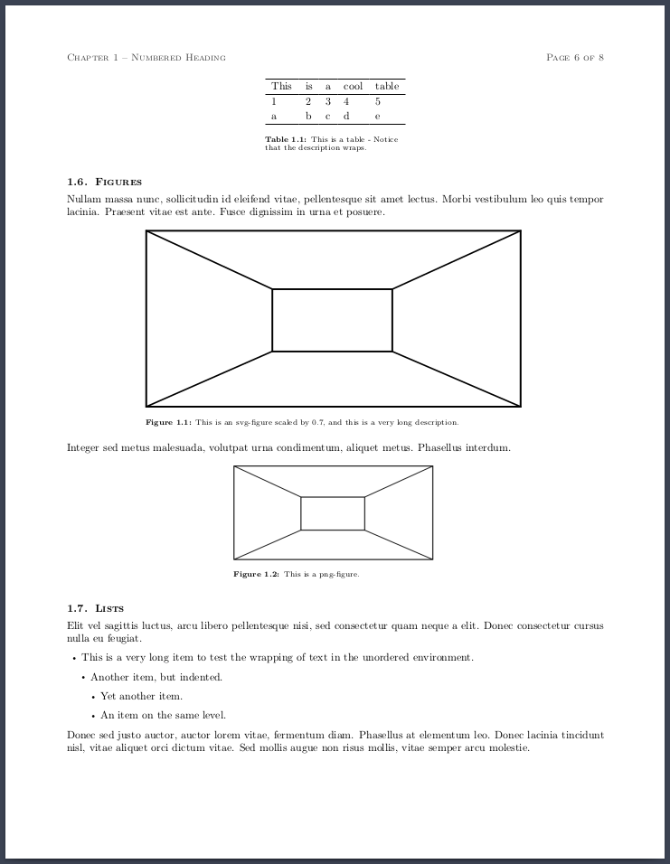 |  |
| [Novella](tests/custom_classes/novella.cls) is meant for short-stories with the intent to print. ([tex](tests/custom_classes/novella_example.tex))| 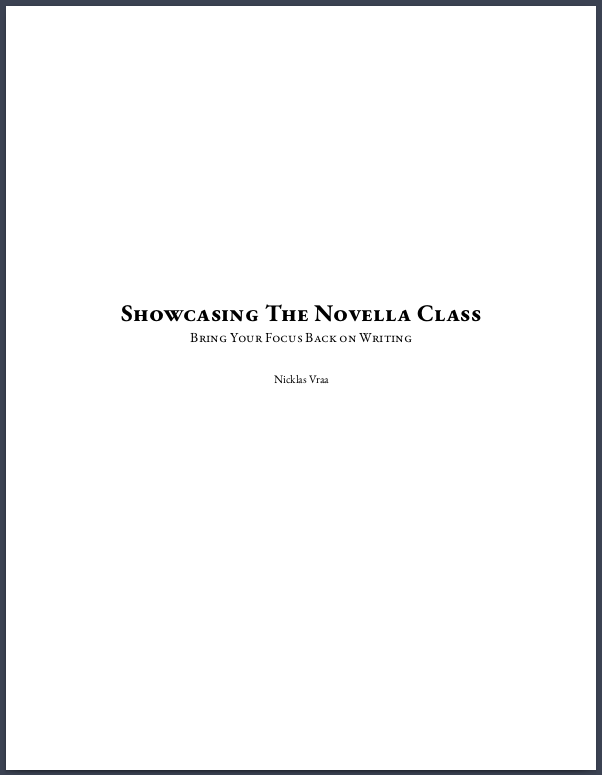 | 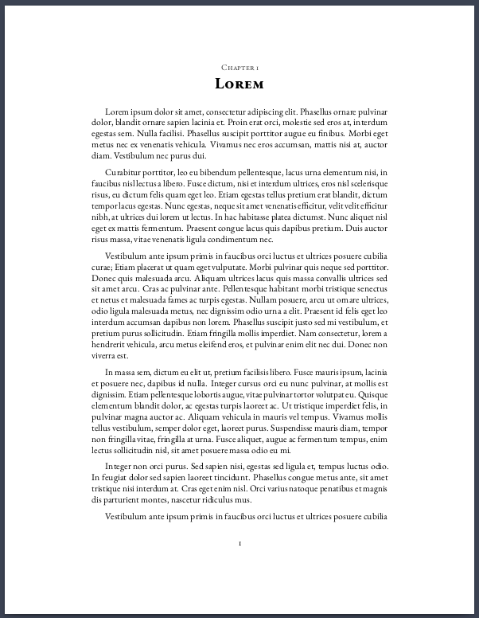 | 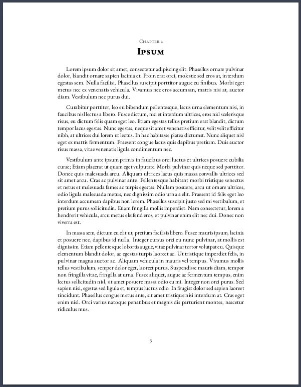 |
| [News](tests/custom_classes/news.cls) is designed as a classic newspaper akin to the The New York Times. ([tex](tests/custom_classes/news_example.tex))| 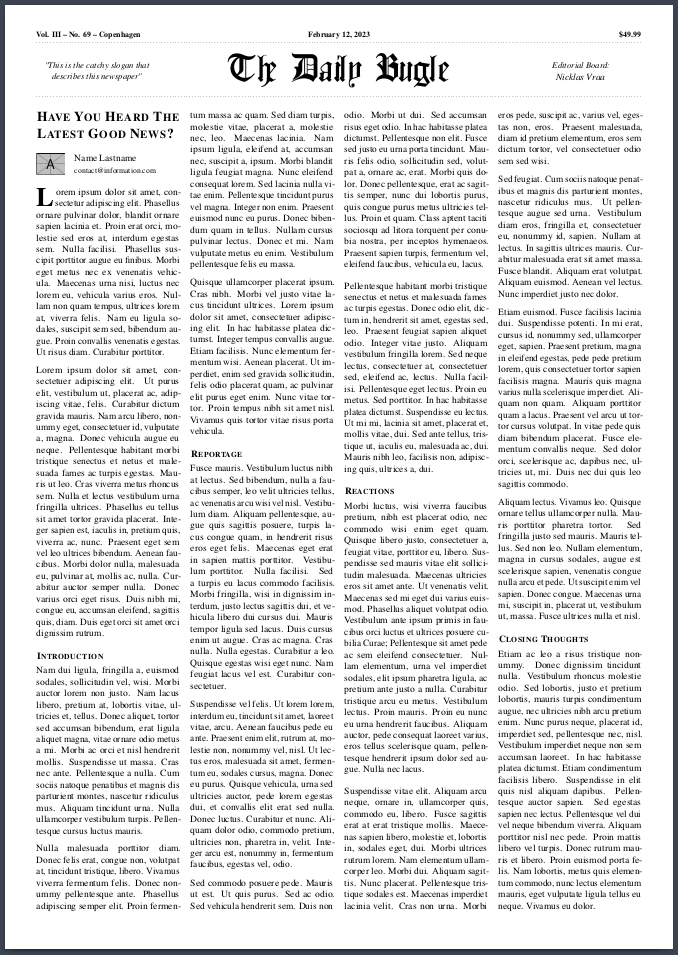 |  |
| [IEEE](tests/popular_classes/ieee.cls) implements the IEEE journal and transactions template, but using LiX. ([tex](tests/popular_classes/ieee_example.tex))|  | 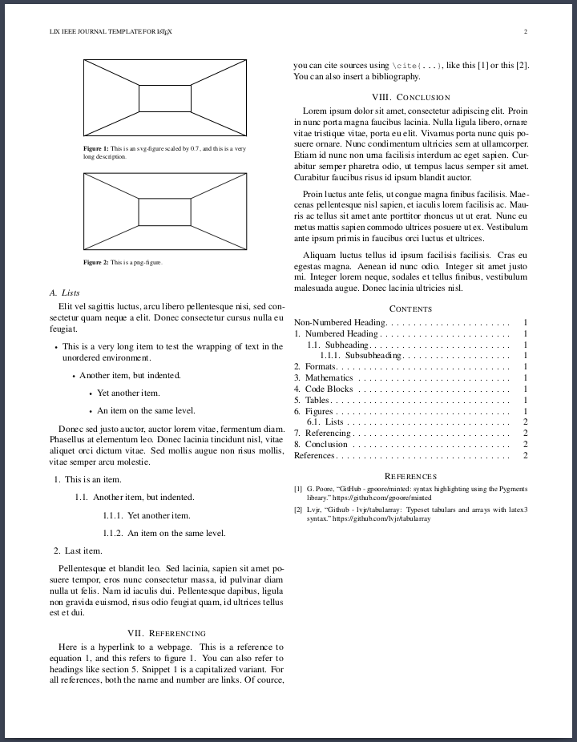 |


It is also possible to use the standard classes, like [article](tests/standard_classes/article_example.tex), [report](tests/standard_classes/report_example.tex) and [book](tests/standard_classes/book_example.tex), but still benefits from simplified syntax. Simply import the package and specify the `stdclass` option, along with any bundles, e.g.:
```latex
\documentclass{article}
\usepackage[stdclass, ...]{lix}
```

The currently available bundles are (in alphabetical order):
```latex
code, configs, cover, figures, formats, header, headings, lists, math, meta, refs, tables, titlepage, toc, formal
```
Exactly what each bundle provides is specified in the next section.

---
## 2. LiX Syntax <a name="syntax"></a>
This is an overview of the commands, which are available when specifying a certain bundle (in alphabetical order). To those unfamilier with LaTeX, a command is always prefixed with a backslash `\`, mandatory input is enclosed in `{}` and optional input is enclosed in `[]`. Whitespace between a command and its input does not matter. Comments are always prefixed with a percentage symbol `%`.

Shortcuts: [Aliases ](#aliases-), [Code ](#code-), [Configs ](#configs-), [Cover ](#cover-), [Figures ](#figures-), [Formats ](#formats-), [Header ](#header-), [Heading ](#heading-), [Lists ](#lists-), [Math ](#math-), [Refs ](#refs-), [Tables ](#tables-), [Titlepage ](#titlepage-), [Toc ](#toc-), [Formal](#formal-)

A [cheatsheet](cheatsheet.md) is also available.

### Aliases <a name="aliases"></a>
These are always available and are simply aliases, which are more intuitive for a new LaTeX-user.
```latex
\use{package1, package2, ...} % Import packages.
\add{path/to/file.tex} % Inserts the tex-code from the given file.
\url{text}{link} % E.g. {this website}{https://www.somewebsite.com}

\cols{n}{
... % Will be horizonally aligned across n columns.
}
```

### Code <a name="code"></a>
Code blocks will be subtly highlighted according to the given language.
```latex
% Available with the 'code' option.
\code{label}{language}{
    % Your code.
}{caption}
```
Caption is optional. For no highlighting, set the language to `text`. Indent the code four spaces, as these will be gobbled (removed) in the resulting pdf. This is for better readability in the source file. I recommend indenting all code-blocks, tables, figures, etc.

### Configs <a name="configs"></a>
For setting up the basic characteristics of your document.
```latex
% Available with the 'configs' option.
\lang    {language}
\size    {standard}{orientation}

\margins {top}{bot}{left}{right}
% Alternatively: {all}, {topbot}{leftright}, {top}{bot}{leftright}
```

For the `\size` command:
| ISO-A | ISO-B | ISO-C | ANSI | US | Orientation |
|-------|-------|-------|------|----|-------------|
| `a0` <br> `a1` <br> ... <br> `a6` | `b0` <br> `b1` <br> ... <br> `b6` | `c0` <br> `c1` <br> ... <br> `c6` | `ansia` <br> `ansib` <br> ... <br> `ansie` | `letter` <br> `executive` <br> `legal` | `portrait` <br> `landscape` |

E.g `\size{a4}{portrait}`.

### Cover <a name="cover"></a>
The front and back of a book.
```latex
% Available with the 'cover' option.
\cover{path/to/front.pdf}{path/to/back.pdf}
\blurb{Flavor text for the back}
```
`cover*` will **not** print the title, author, etc. on top of the cover. This is useful, if the cover already includes these.

### Figures <a name="figures"></a>
This command will take care of placing your figure correctly and it is file-format agnostic i.e. it works the same for both regular images and vector graphics.
```latex
\fig{label}{scale}{path}{caption}
```
Caption is optional.

### Formats <a name="formats"></a>
These command names were chosen to ensure that the readability of the source code is minimally affected.
```latex
\b{...} % (b)old text.
\c{...} % (c)ode inline.
\i{...} % (i)talic text.
\l{...} % (l)arge letter.
\m{...} % (m)ath inline.
\s{...} % (s)trikeout.
\u{...} % (u)nderline.
```

### Header <a name="header"></a>
The strip of text at the top of each page.
```latex
% Available with the 'header' option.
\header{left}{center}{right}
```

### Heading <a name="heading"></a>
Top-level headings will act like chapters in book-like classes, but as sections in article-like classes. Headings will be numbered, unless a `*` is added to the command, e.g. `\h*{...}`.
```latex
\h{...}    % Level one.
\hh{...}   % Level two.
\hhh{...}  % Level three.
\hhhh{...} % Level four.
```
The regular commands, like `\chapter` and `\section` can still be used along with their starred counterparts.

### Lists <a name="lists"></a>
The syntax and styling of these lists has been simplified and it is still possible to nest lists.
```latex
\items{
¤ Something
¤ Another thing.
    \items*{
    ¤ Something else
    ¤ The final thing.
    }
}
```
`items{...}` will be numbered, and `items*{...}` will be bullet points. If you want to use a different symbol for denoting a new item, simply find-and-replace it in the `lix.cls` file. The `¤` was chosen because it is never used and it resembles a bullet point.

### Math <a name="math"></a>
The label is required and the math block will be numbered.
```latex
\math{label}{
    % Regular latex math.
}
```
Shortcut commmands in the math environment:
- `\mean{x}` $\rightarrow \overline{x}$
- `\Re` $\rightarrow \mathbb{R}$ (Real set)
- `\Im` $\rightarrow \mathbb{I}$ (Imaginary set)
- `\N` $\rightarrow \mathbb{N}$ (Natural set)
- `\Z` $\rightarrow \mathbb{Z}$ (Integer set)
- `\Q` $\rightarrow \mathbb{Q}$ (Rational set)
- `\C` $\rightarrow \mathbb{C}$ (Complex set)
- `\epsilon` $\rightarrow \varepsilon$ (varepsilon)

### Refs <a name="refs"></a>
Reference your figures, tables, math, codeblocks, etc., using your own labels. Cite external sources from your bibliography.
```latex
\r{label}          % Reference figures, tables, etc.
\R{label}          % Uppercase equivalent of \r.

\cite{your_source} % As defined in your bibliography file.

\bib{path/to/refs}{style}
% Without the '.bib' extension.
% Style is optional, default is in order of appearence.
```
Bibliography Styles:
```latex
abbrv, acm, alpha, apalike, ieeetr, plain, siam, unsrt
```

### Tables <a name="tables"></a>
There are three types. These three tables will cover 90% of your table-needs, but you have access to the full power of the tabularray package for more complicated tables. The `&` symbol separates items and `\\` separates rows.
```latex
\tabs{label}{type}{
    % Your table content.
}{caption}
```
Caption is optional.

Types:
- `cols`: Classic table, the top row acts as the header.
- `rows`: The left-most column acts as the header.
- `grid`: Both the top row and left-most column act as headers.

Formatting code for the table can also be given explicitly in the type field.

### Titlepage <a name="titlepage"></a>
Automatically imported, if `cover` option is specified.
```latex
% Available with the 'titlepage' option.
\title    {This is your Title}
\subtitle {And your Subtitle}
\authors  {Name Lastname}{Another Name}...
\date     {01/01/2023} % \today is available.
\abstract {Summary of your findings}
```
The `authors` command handles up to six entries.

### Toc <a name="toc"></a>
Print table of content, as is appropriate for your current document-class.
```latex
\toc
```

### Formal <a name="formal"></a>
The page after the front-cover of a book, which contain formalities.
```latex
% Available with the 'formal' option.
\license   {type}{modifiers}{version}{holder}
\isbn      {978-0201529838}
\edition   {123}{year}
\publisher {Your Publishing Company}
\dedicate  {dedicatee}{Message}
\thank     {people or organisations}
\note      {Longer author's note}
```

For the `\license` command:
| Types | Modifiers | Versions |
|-------|-----------|----------|
| Creative Commons: `CC` | Attribution: `by` <br> ShareAlike: `sa` <br> NoDerivatives: `nd` <br> NonCommercial: `nc` <br> | Universal: `1.0` <br> Unported: `3.0` <br> International: `4.0` |

E.g `\license{CC}{by-nc-sa}{3.0}`. Holder is optional.


---
## 3. Installation <a name="installation"></a>
The LiX package and all classes work out-of-the-box with [Overleaf](https://www.overleaf.com). Simply include `lix.sty` and the appropriate `.cls` file in your project folder.

If you are working locally, you need to have all package dependencies installed. Depending on which bundles are imported, LiX may import the following packages:

> [amsfonts](https://ctan.org/pkg/amsfonts), [amsmath](https://ctan.org/pkg/amsmath), [amssymb](https://ctan.org/pkg/amsfonts), [babel](https://ctan.org/pkg/babel), [caption](https://ctan.org/pkg/caption), [cite](https://ctan.org/pkg/cite), [doclicense](https://ctan.org/pkg/doclicense), [ebgaramond](https://ctan.org/pkg/ebgaramond), [enumitem](https://ctan.org/pkg/enumitem), [esint](https://ctan.org/pkg/esint), [eso-pic](https://ctan.org/pkg/eso-pic),, [fancyhdr](https://ctan.org/pkg/fancyhdr), [float](https://ctan.org/pkg/float), [fontenc](https://ctan.org/pkg/fontenc), [geometry](https://ctan.org/pkg/geometry), [graphicx](https://ctan.org/pkg/graphics), [GS1](https://ctan.org/pkg/gs1), [hyperref](https://ctan.org/pkg/hyperref), [inconsolata](https://ctan.org/pkg/inconsolata), [inputenc](https://ctan.org/pkg/inputenc), [lastpage](https://ctan.org/pkg/lastpage), [lettrine](https://ctan.org/pkg/lettrine), [listings](https://ctan.org/pkg/listings), [microtype](https://ctan.org/pkg/microtype), [multicol](https://ctan.org/pkg/multicol), [numspell](https://ctan.org/pkg/numspell), [parskip](https://ctan.org/pkg/parskip), [setspace](https://ctan.org/pkg/setspace), [silence](https://ctan.org/pkg/silence), [siunitx](https://ctan.org/pkg/siunitx), [svg](https://ctan.org/pkg/svg), [tabularray](https://ctan.org/pkg/tabularray), [titlesec](https://ctan.org/pkg/titlesec), [titletoc](https://ctan.org/pkg/titletoc), [titling](https://ctan.org/pkg/titling), [tocbibind](https://ctan.org/pkg/tocbibind), [ulem](https://ctan.org/pkg/ulem), [xcolor](https://ctan.org/pkg/xcolor), [xparse](https://ctan.org/pkg/xparse)

Check up on the [svg](https://ctan.org/pkg/svg?lang=en) package, which has non-latex dependencies. If you have svg's included in your document, the compiler has to be run with the argument: `--shell-escape`.

For VSCode, I recommend installing the [LaTeX Workshop](https://github.com/James-Yu/LaTeX-Workshop) extension, and adding this [snippet file](lix.code-snippets) to your snippets collection, and this [entry](settings.json) to your own `settings.json` file.


---
## 4. Plans <a name="plans"></a>
- Further simplify table syntax and add more types.
- Create syntax highlighter for VSCode.
