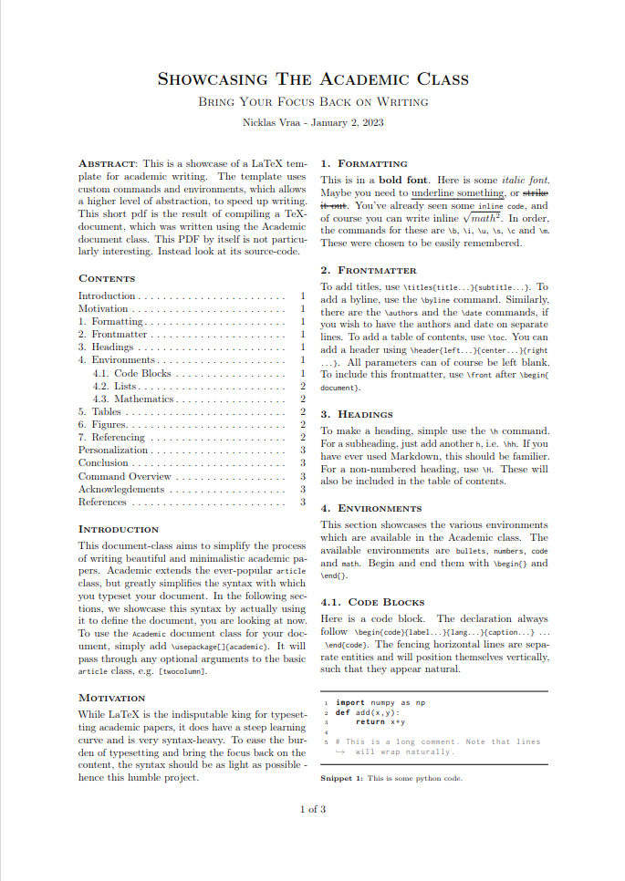
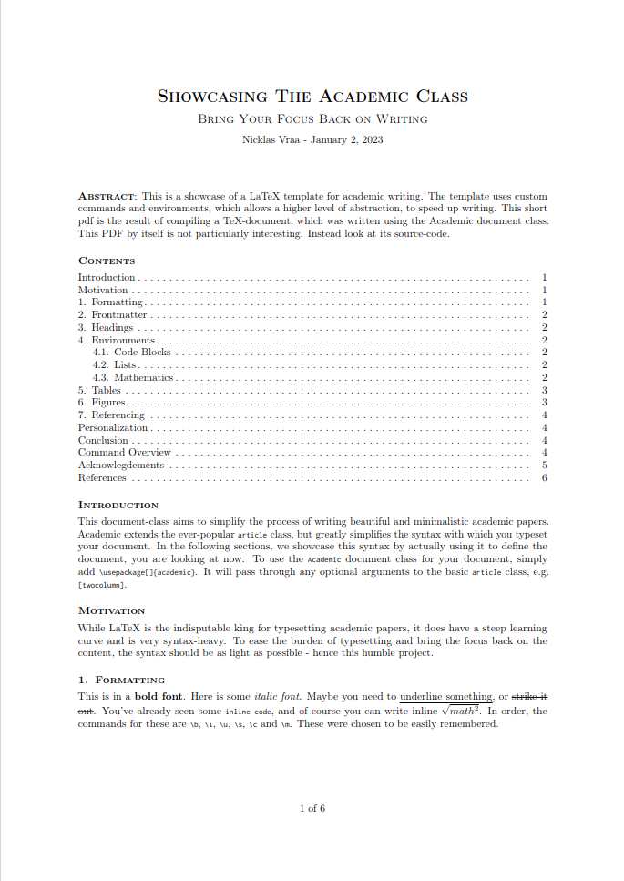
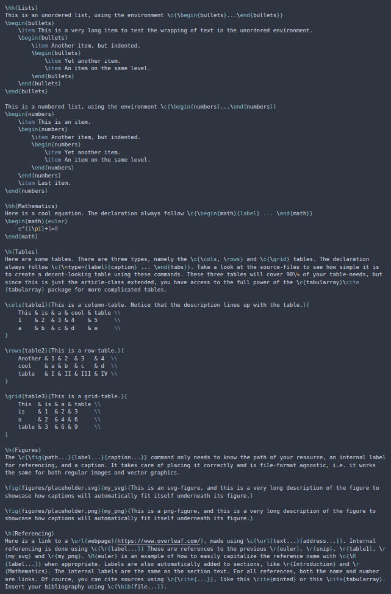
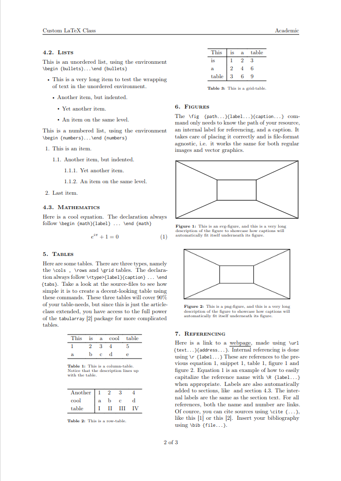
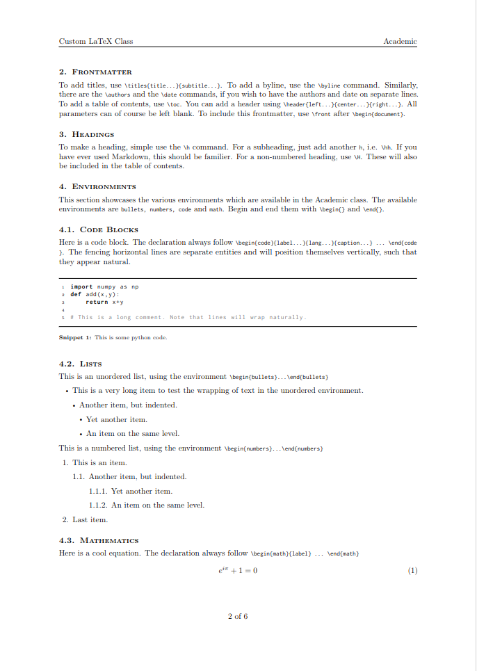
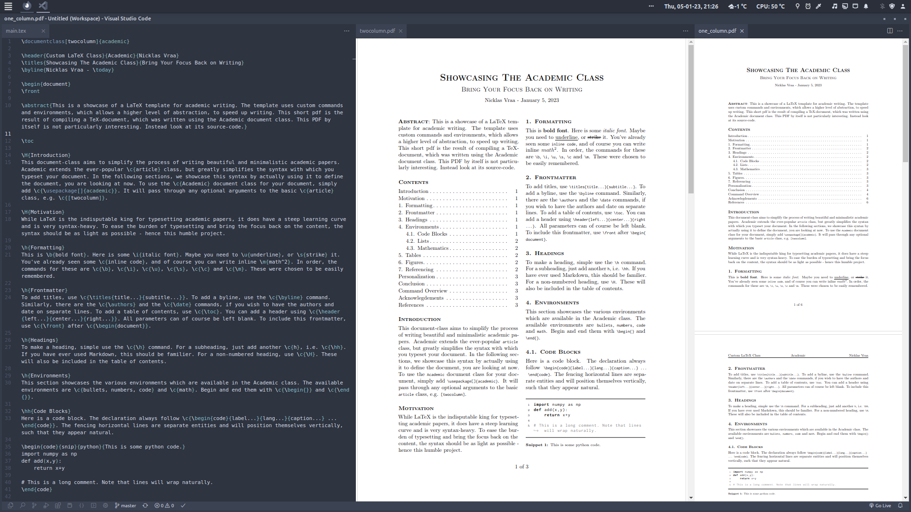
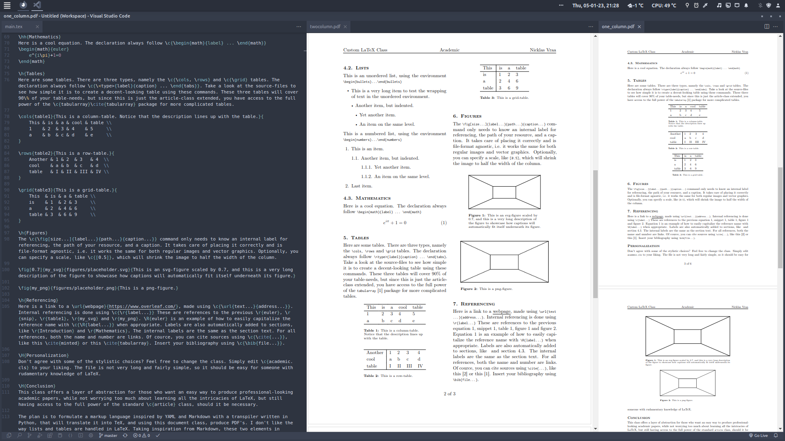

# LaTeX Class Abstractions
This will eventually be a collection of classes, which simplify the user's interaction with the basic LaTeX-classes. For now, only the `article`-class has been abstracted.

## The `Paper` LaTeX Class
This is a showcase of the LaTeX document-class called `paper`, which abstracts `article` for academic writing. It implements custom commands and environments, which allow a higher level of abstraction, to speed up writing.

While LaTeX is the indisputable king for typesetting academic papers, it does have a steep learning curve and is very syntax-heavy. To ease the burden of typesetting and bring the focus back on the content, the syntax should be as light as possible - hence this humble project.

### Example
When writing an academic paper, I want to keep the amount of markup/LaTeX-code, that I have to write, to an absolute minimum, but still have the syntax make intuitive sense, much like when writing Markdown.

Take a look at this example, which also acts as a manual:
| Source                | Two-column            | One-column            |
|-----------------------|-----------------------|-----------------------|
|  |  |  |
|  |  |  |
|  |  |  |
|                       |                       | Pages 4 to 6...       |

In-action using VSCode:
|                                         |                                         |
|-----------------------------------------|-----------------------------------------|
|  |  |

Access the generated pdf's here: [One-column](compiled_pdfs/paper_one_column.pdf) and [two-column](compiled_pdfs/paper_two_column.pdf).

### Installation
It works out-of-the-box with [Overleaf](https://www.overleaf.com). Simply include the [paper.cls](paper.cls) file in your project folder.

If you are working locally, you need to have all package dependencies installed. Check up on the [svg](https://ctan.org/pkg/svg?lang=en) package, which has non-latex dependencies. If you have svg's included in your document, the compiler has to be run with the argument: `--shell-escape`.

### Plans
- Simplify the way lists are defined.

### Changelog
- Replaced `minted` with `listings` to remove dependency on Pygmentize.
- Added optional scaling argument to `\fig`.
- Increased margins for onecolumn-layout.
- Automatically adjust margins and title placement, if `\header` is called.
- Removed dependency on `ifthen` package.
