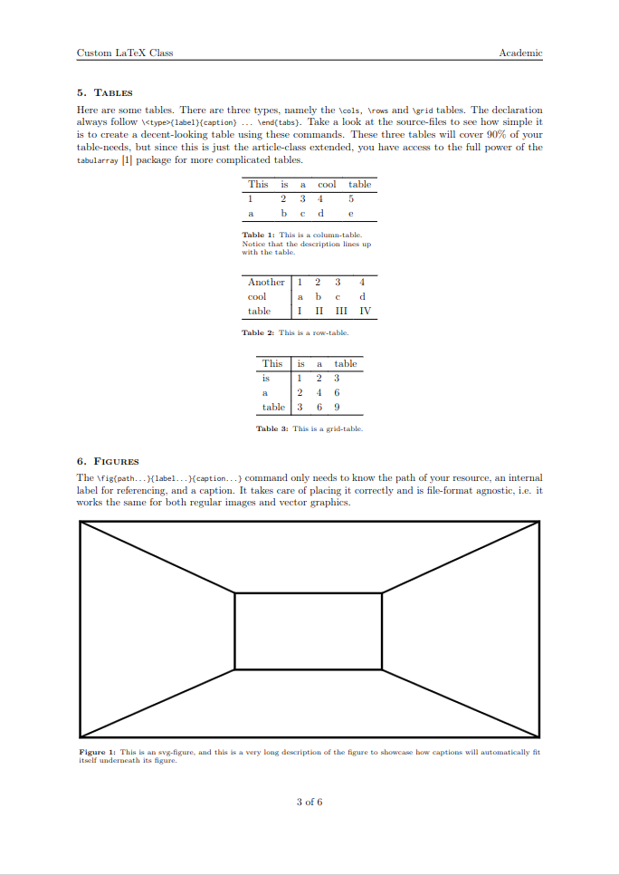

# The `Academic` LaTeX Class
This is a showcase of a LaTeX document class for academic writing. It implements custom commands and environments, which allow a higher level of abstraction, to speed up writing.

While LaTeX is the indisputable king for typesetting academic papers, it does have a steep learning curve and is very syntax-heavy. To ease the burden of typesetting and bring the focus back on the content, the syntax should be as light as possible - hence this humble project.

Take a look at this example, which also acts as a manual:
| Source                | Two-column            | One-column            |
|-----------------------|-----------------------|-----------------------|
|  |  |  |
|  |  |  |
|  |  |  |
|                       |                       | Pages 4 to 6...       |

Access the generated pdf's here: [One-column](onecolumn.pdf) and [two-column](twocolumn.pdf).

It works out-of-the-box with overleaf, but locally, you need to have all package dependencies installed. Check up on the `svg` package, which has non-latex dependencies. If you have svg's included in your document, the compiler has to be run with the argument: `--shell-escape`.

This was made entirely for my own workflow.

## Changelog:
- Replaced `minted` with `listings` to remove dependency on Pygmentize.
- Added optional scaling argument to `\fig`.
- Increased margins for onecolumn-layout.
