# LaTeX Class Abstractions
This will eventually be a collection of classes, which simplify the user's interaction with the basic LaTeX-classes by abstracting much of the functionality into higher-level functions with intuitive syntax, much like Markdown, which speeds up writing and allows one to focus on the contents, rather than the typesetting.

**Motivation** \
While LaTeX is the indisputable king for typesetting academic papers, it does have a steep learning curve and is very syntax-heavy. To ease the burden of typesetting and bring the focus back on the content, the syntax should be as light as possible - hence this humble project.

**Classes**
- `Paper` is for typesetting an academic research paper or longer university assignment. It abstracts the `article` class.
- `Tome` is for typesetting an academic piece of litterature, like a textbook or a dissertation. It abstracts on the `report` class.
- `Novel` is for typesetting fiction, like a novel or a short-story. It abstracts the `book` class.

---
## The `Paper` Class
This class strives to pack as much information as possible, into a visually coherent environment, while adhering to the standards of academic research papers, like having references, citations and captions. Below is an example, which also acts as a manual. Access the full document [here](paper_example.pdf).
| Source                             | Build (Two-column)             |
|------------------------------------|--------------------------------|
| 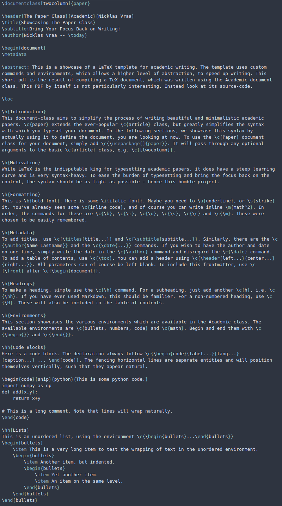 | 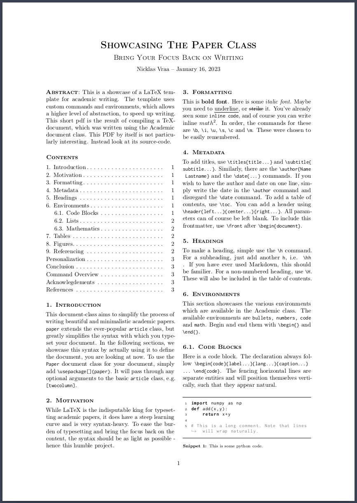 |
| 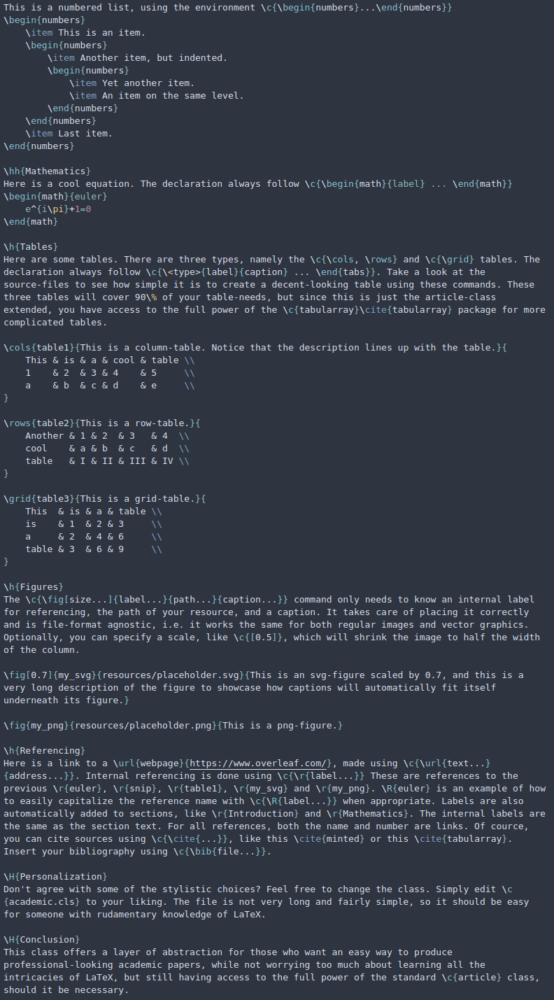 | 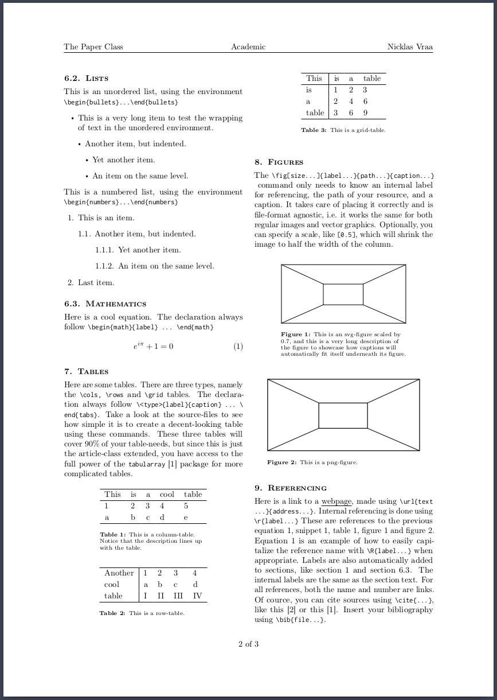 |
| 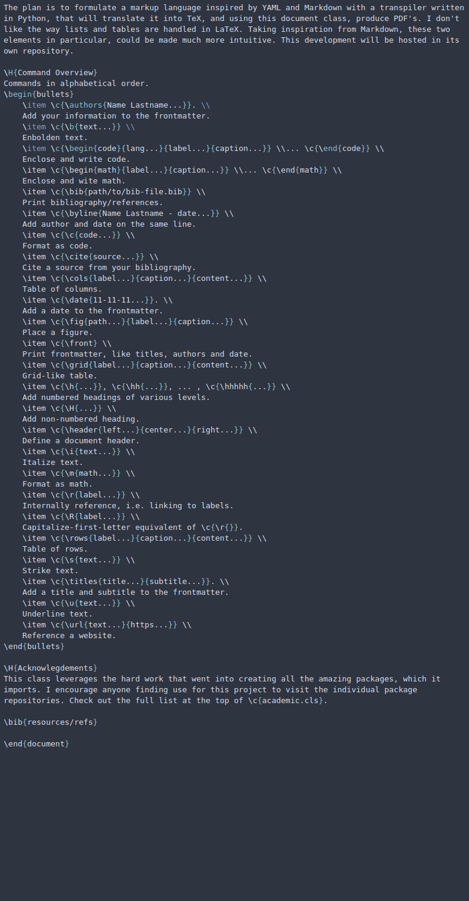 | 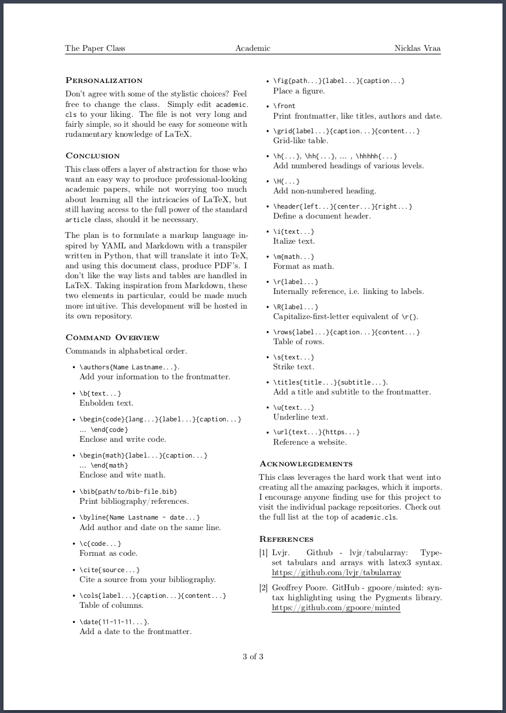 |

---
## The `Tome` Class
This class is intended to typeset a large amount of academic content to be printed in book form. As with the paper class, it focuses on visual coherence, while adhering to the standards of academic printing, like having a title- and metadata page, references, citations and captions. Below is an example, which also acts as a manual. Access the full document [here](tome_example.pdf).
| Source                             | Build (One-column)           |
|------------------------------------|------------------------------|
| 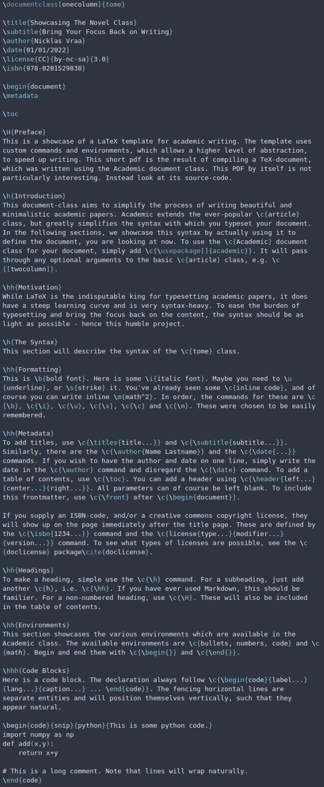 | 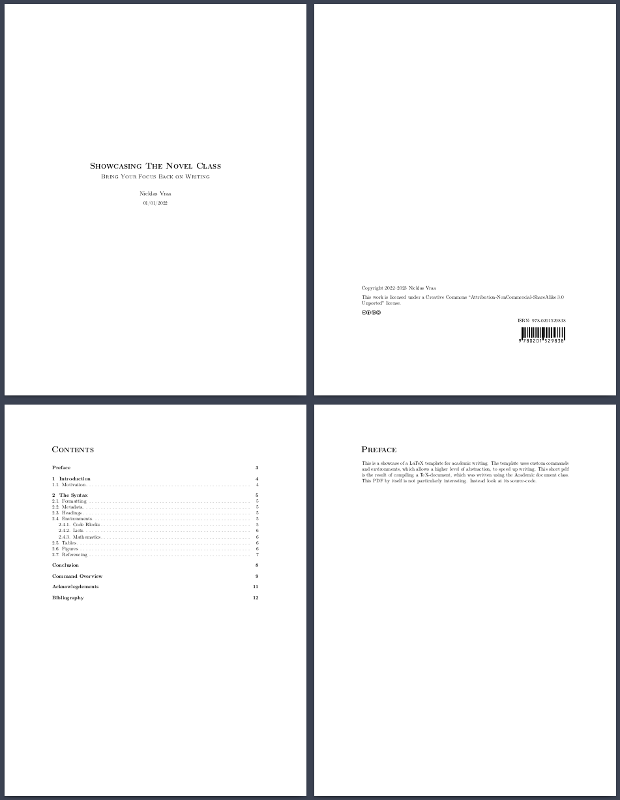 |
| 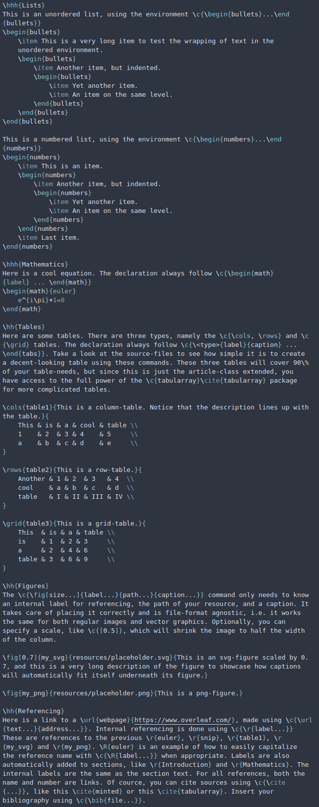 | 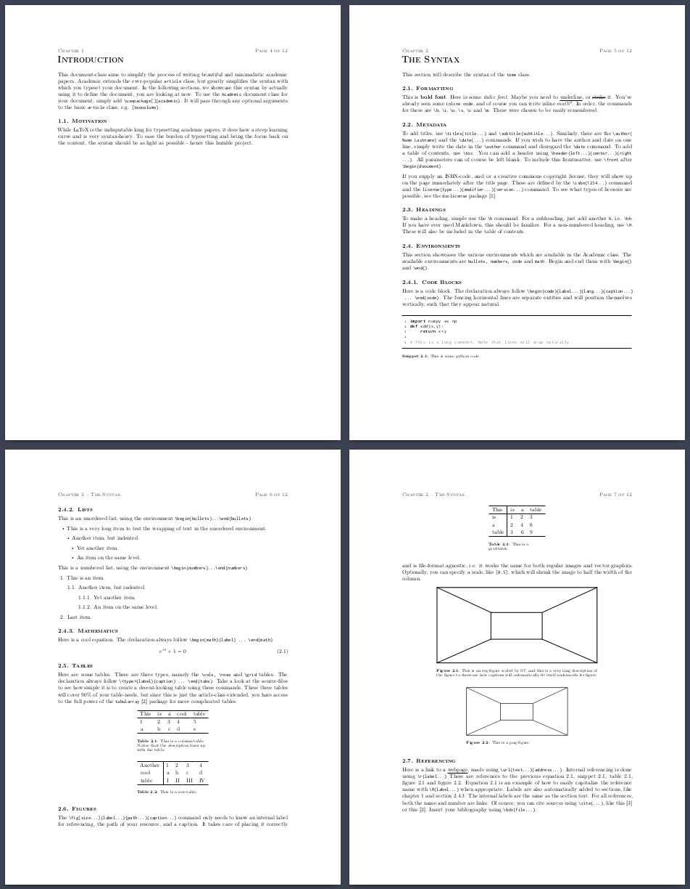 |
| 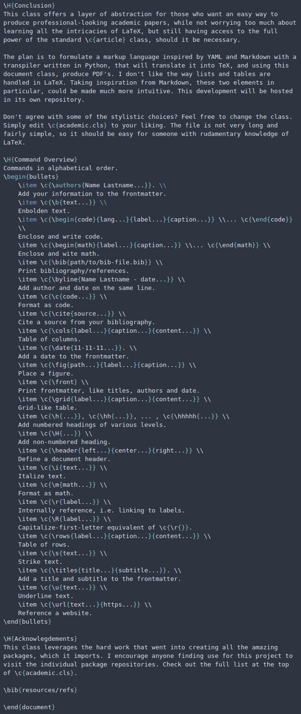 | 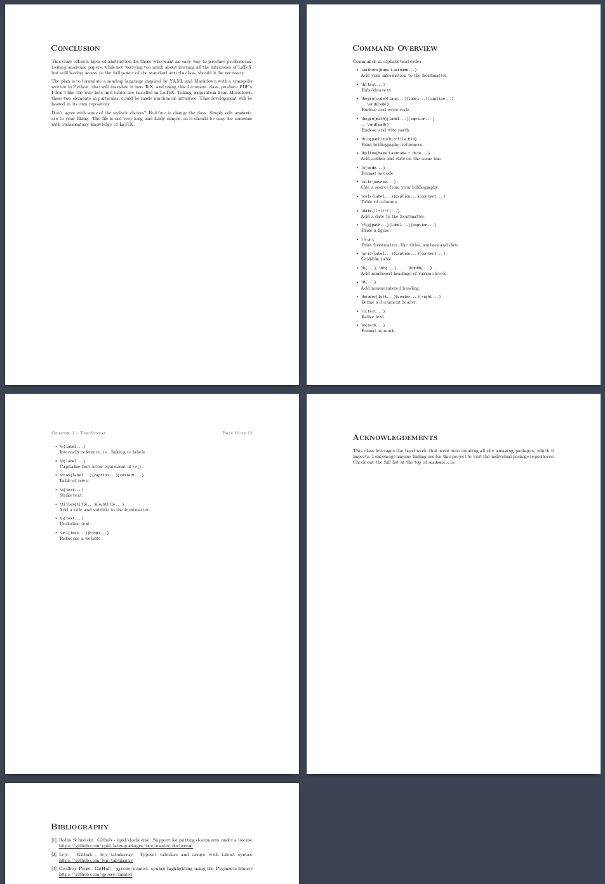 |

---
## The `Novel` Class
This class is meant for typesetting fiction with the intent to print. Access the full document [here](novel_example.pdf).
| Source                             | Build                          |
|------------------------------------|--------------------------------|
| 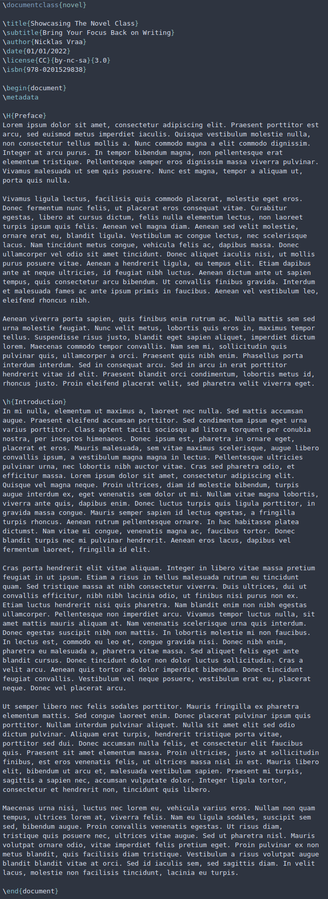 | 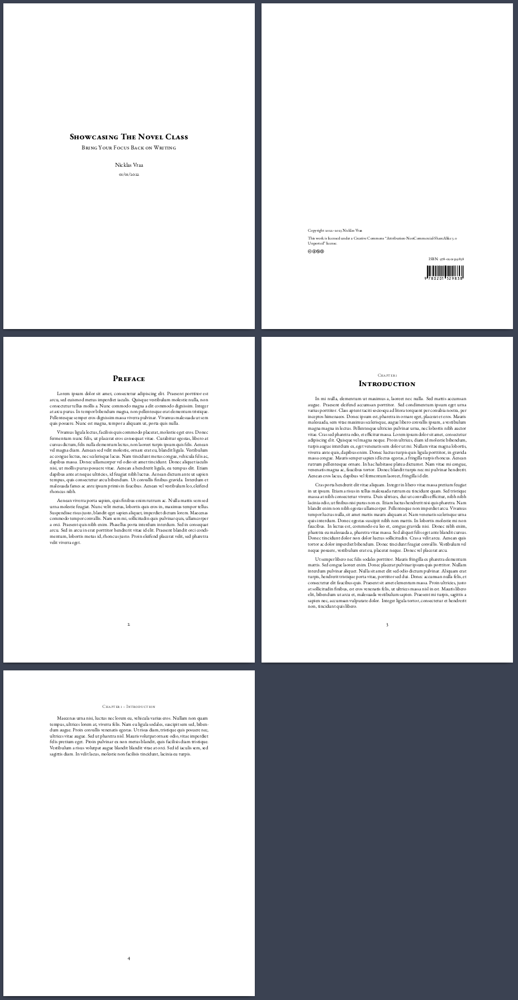 |

---
## Installation
All classes work out-of-the-box with [Overleaf](https://www.overleaf.com). Simply include the appropriate `.cls` file in your project folder.

If you are working locally, you need to have all package dependencies installed. Check up on the [svg](https://ctan.org/pkg/svg?lang=en) package, which has non-latex dependencies. If you have svg's included in your document, the compiler has to be run with the argument: `--shell-escape`.

## Plans
- Simplify the way lists are defined.

## Changelog
Paper:
- Replaced `minted` with `listings` to remove dependency on Pygmentize.
- Added optional scaling argument to `\fig`.
- Increased margins for onecolumn-layout.
- Automatically adjust margins and title placement, if `\header` is called.
- Removed dependency on `ifthen` package.
