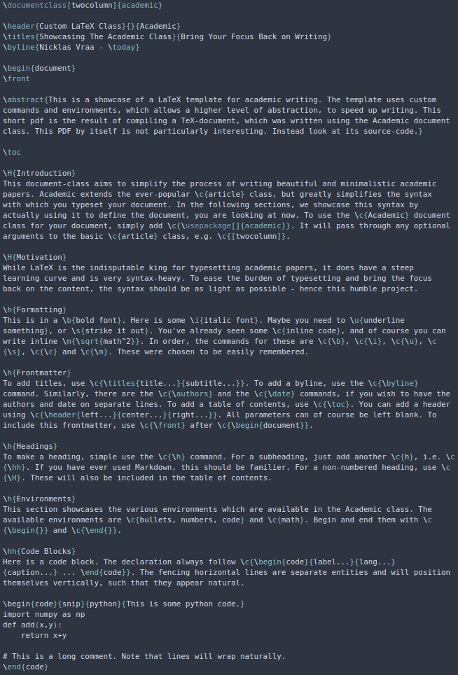
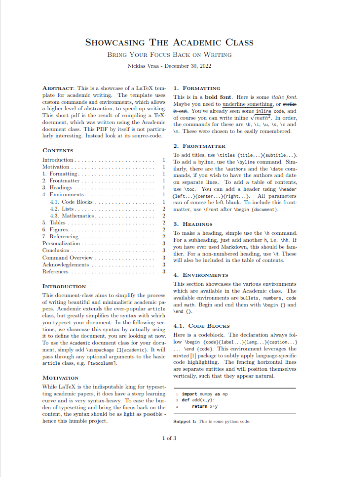
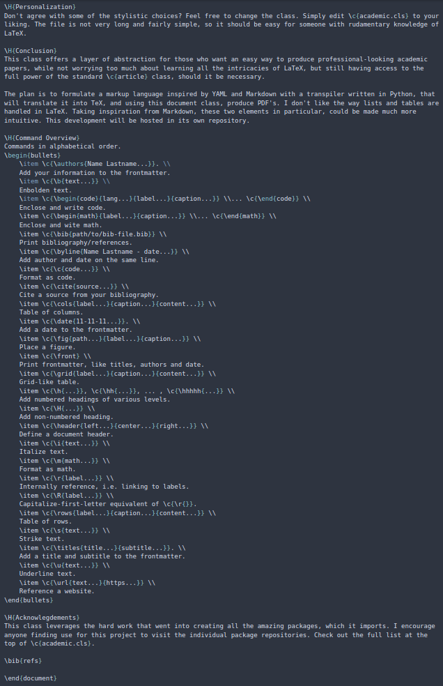
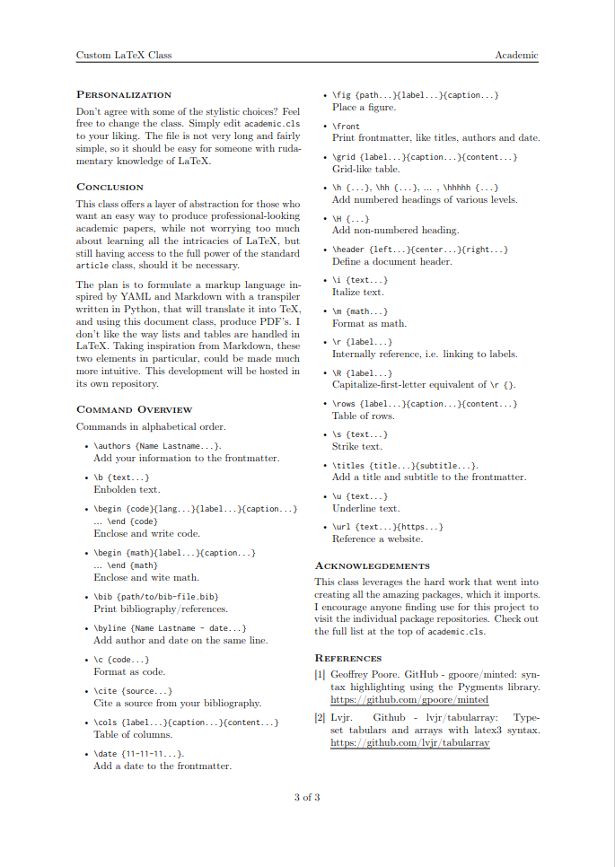

# The `Academic` LaTeX Class
This is a showcase of a LaTeX template for academic writing. The template uses custom commands and environments, which allows a higher level of abstraction, to speed up writing.

While LaTeX is the indisputable king for typesetting academic papers, it does have a steep learning curve and is very syntax-heavy. To ease the burden of typesetting and bring the focus back on the content, the syntax should be as light as possible - hence this humble project.

Take a look at this example, which also acts as a manual:
| Source                | Result                |
|-----------------------|-----------------------|
|  |  |
|  |  |
|  |  |

Access the full generated pdf [here](main.pdf).

It works out-of-the-box with overleaf.

This was made entirely for my own workflow, and I do not intend to maintain or fix issues in the future. Do with it, as you please.
