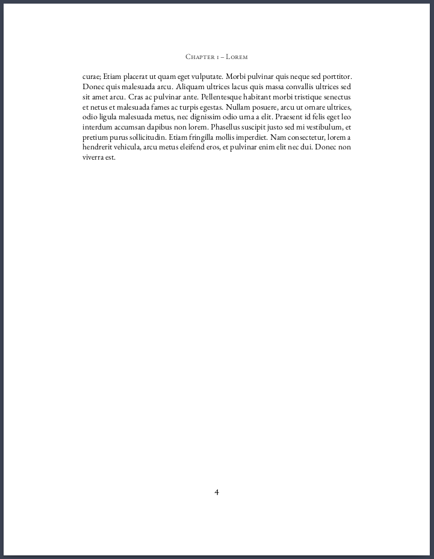
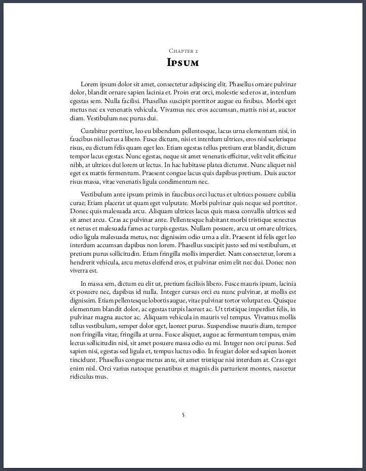
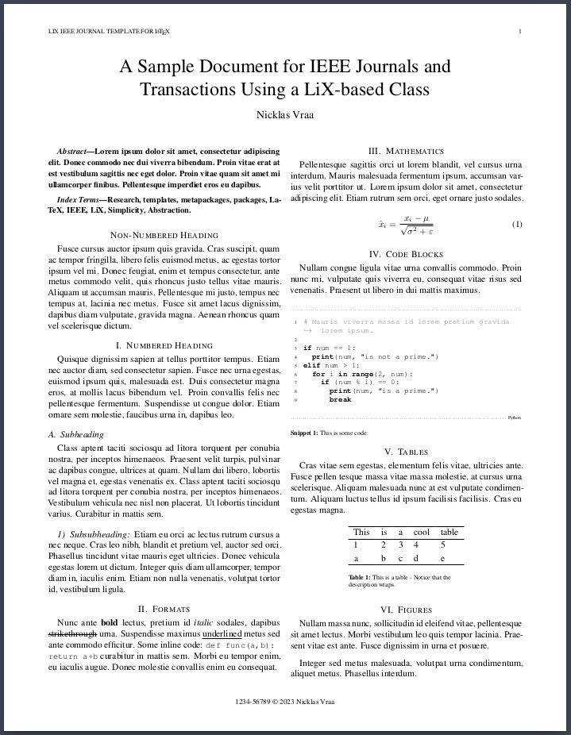

# Showcase <!-- omit from toc -->

- [Custom Classes](#custom-classes)
  - [Novel](#novel)
  - [Textbook](#textbook)
  - [Paper](#paper)
- [Popular Classes](#popular-classes)
  - [IEEE Journal and Transactions](#ieee-journal-and-transactions)
- [Standard Classes](#standard-classes)
  - [Article](#article)
  - [Report](#report)
  - [Book](#book)

---
## Custom Classes
### Novel
| Page 1 | Page 2 | Page 3 | Page 4 | Page 5 | Page 6 | Page 7 |
| ------ | ------ | ------ | ------ | ------ | ------ | ------ |
|  |  |  |  |  |  |  |

### Textbook

### Paper

## Popular Classes
### IEEE Journal and Transactions
| Page 1 | Page 2 |
| ------ | ------ |
|  |  |

---
## Standard Classes
### Article
### Report
### Book
